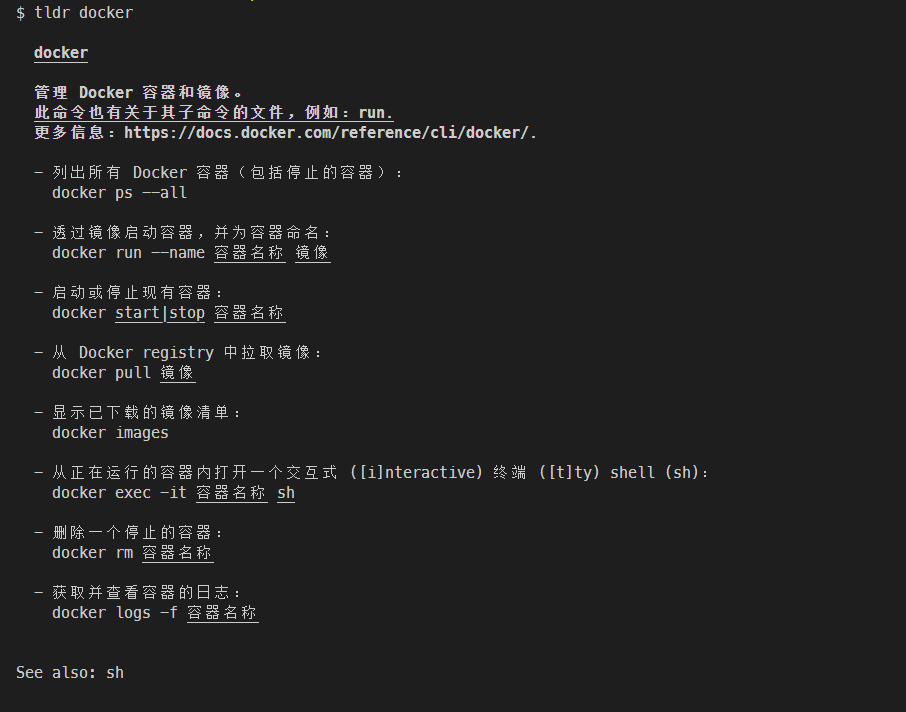
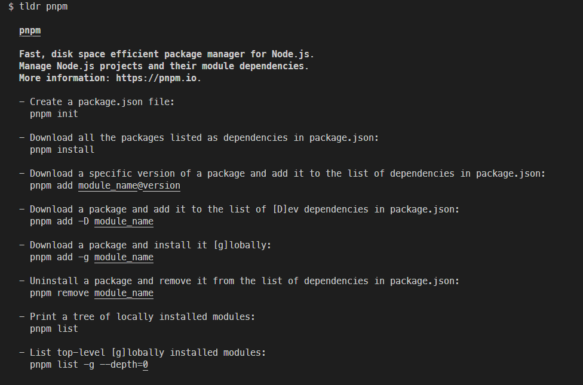

# TLDR 命令使用和介绍

## 什么是 TLDR？

TLDR 是一个社区驱动的命令行工具，旨在提供简洁易懂的命令行工具使用说明。它的名称来源于 "Too Long; Didn't Read"，目标是为繁琐的 `man` 手册页提供简化版替代。

与传统的 `man` 页面相比，TLDR 更加简洁明了，聚焦于最常用的命令示例，非常适合初学者或需要快速查阅命令用法的用户。

## TLDR 的主要特点

1. **简单明了**：去除冗长的技术细节，仅展示常用命令及其简洁的解释。
2. **多平台支持**：支持 Linux、macOS 和 Windows。
3. **社区驱动**：内容由全球开发者贡献，并不断更新。
4. **支持离线模式**：首次访问后，缓存内容可离线使用。

---






## 如何安装 TLDR？

### 使用包管理器安装

#### 在 macOS 或 Linux 上：

```bash
brew install tldr
```

#### 在 Windows 上：

```powershell
scoop install tldr
# 或使用 choco
choco install tldr
```

#### 使用 npm 安装（跨平台）：

```bash
npm install -g tldr
```

---


## 基本使用方法

### 可以再使用前先更新一下缓存

```bash
tldr --update
```


### 查看命令示例

输入需要查询的命令名称即可：

```bash
tldr <命令>
```

例如：

```bash
tldr ls
```

输出：

```plaintext
ls
列出目录内容。

- 列出当前目录下的所有文件：
  ls

- 列出包含详细信息的文件：
  ls -l

- 显示隐藏文件：
  ls -a
```

### 更新缓存

确保你的页面是最新版本：

```bash
tldr --update
```


### 显示帮助信息

```bash
tldr --help
```


### 搜索命令

通过关键词查找相关命令：

```bash
tldr -s <关键词>
```

### 使用主题（不同样式）

```bash
tldr --theme <主题名称>
```


### 切换语言到中文

TLDR 支持多种语言，包括中文。可以通过设置环境变量切换语言：

```bash
export TLDR_LANGUAGE=zh
```

如果使用 Windows PowerShell，可以运行：

```powershell
$env:TLDR_LANGUAGE="zh"
```

使用 npm 安装的 tldr 命令，默认是中文的，所以不需要设置。

---

## 常见问题

### 1. 如果命令不可用怎么办？

可能是缓存未更新，可以尝试运行：

```bash
tldr --update
```

### 2. 如何贡献新的命令或修正错误？

TLDR 项目托管在 GitHub 上，您可以访问其[官方仓库](https://github.com/tldr-pages/tldr)进行贡献。

---

## 总结

TLDR 是一个快速高效的命令行助手，特别适合需要快速了解命令用法的用户。无论是初学者还是资深开发者，它都能在日常开发中提供极大帮助。
