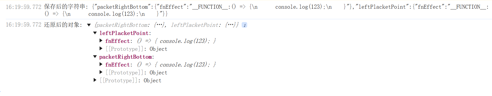

# JSON 序列化函数工具

## 这个工具是做什么的？

这个工具专门用来处理那些包含函数的对象，让它们也能像普通数据一样被保存和传输。普通的 JSON 处理不了函数，但这个工具可以！

## 主要功能

1. **保存功能**：

   - 能把带函数的对象变成字符串保存
   - 给函数加上特殊标记 `__FUNCTION__:`
   - 把函数变成文字存起来

2. **还原功能**：

   - 能把保存的字符串变回原来的对象
   - 能认出特殊标记，把文字变回函数
   - 保持对象原来的样子和功能

3. **什么时候用**：

   - 要保存带函数的设置时
   - 要在不同地方传递带函数的对象时
   - 要把带函数的配置存到文件或数据库时

4. **好处**：

   - 解决了 JSON 不能存函数的问题
   - 函数存了还能用
   - 用起来和普通 JSON 一样简单

5. **要注意的**：
   - 只能处理简单函数
   - 复杂的函数可能还原不了
   - 要注意安全问题

## 实现原理

### 1. 保存函数（序列化）

```js
function serializeConfig(config) {
  return JSON.stringify(config, (key, value) => {
    if (typeof value === "function") {
      return FUNCTION_PREFIX + value.toString();
    }
    return value;
  });
}
```

- **JSON.stringify** 的第二个参数是个回调函数，可以自定义如何处理每个值
- 当遇到值是函数时（`typeof value === "function"`），我们把函数转换成字符串
- 在函数字符串前面加上特殊标记 `__FUNCTION__:`，方便后面识别
- 其他类型的值保持不变

### 2. 还原函数（反序列化）

```js
function deserializeConfig(jsonString) {
  return JSON.parse(jsonString, (key, value) => {
    if (typeof value === "string" && value.startsWith(FUNCTION_PREFIX)) {
      const functionBody = value.slice(FUNCTION_PREFIX.length);
      return new Function("return " + functionBody)();
    }
    return value;
  });
}
```

- **JSON.parse** 的第二个参数也是个回调函数，可以自定义如何处理每个值
- 当遇到字符串值并且以 `__FUNCTION__:` 开头时，说明这是之前保存的函数
- 去掉前缀，得到函数的字符串形式
- 使用 `new Function()` 把字符串重新变成可执行的函数
- 其他类型的值保持不变

### 3. 具体过程示例

假设我们有个对象：

```js
const obj = {
  name: "test",
  fn: () => console.log("hello"),
};
```

**保存过程**：

1. 遇到 `name: "test"`，直接保存
2. 遇到 `fn: () => console.log("hello")`，转换成：
   ```
   "__FUNCTION__:() => console.log("hello")"
   ```
3. 最终保存的字符串：
   ```json
   { "name": "test", "fn": "__FUNCTION__:() => console.log(\"hello\")" }
   ```

**还原过程**：

1. 遇到 `name: "test"`，直接还原
2. 遇到 `fn: "__FUNCTION__:() => console.log(\"hello\")"`，去掉前缀，用 `new Function()` 还原成函数
3. 最终得到和原来一样的对象

## 完整代码示例

```js
// 一个带函数的对象
const effect = {
  packetRightBottom: {
    fnEffect: () => {
      console.log(123);
    },
  },
  leftPlacketPoint: {
    fnEffect: () => {
      console.log(123);
    },
  },
};

// 定义函数标记
const FUNCTION_PREFIX = "__FUNCTION__:";

// 保存函数
function serializeConfig(config) {
  return JSON.stringify(config, (key, value) => {
    if (typeof value === "function") {
      return FUNCTION_PREFIX + value.toString();
    }
    return value;
  });
}

// 还原函数
function deserializeConfig(jsonString) {
  return JSON.parse(jsonString, (key, value) => {
    if (typeof value === "string" && value.startsWith(FUNCTION_PREFIX)) {
      const functionBody = value.slice(FUNCTION_PREFIX.length);
      return new Function("return " + functionBody)();
    }
    return value;
  });
}

// 使用示例
const configJson = serializeConfig(effect);
console.log("保存后的字符串:", configJson);

const restoredConfig = deserializeConfig(configJson);
console.log("还原后的对象:", restoredConfig);
```

## 结果


